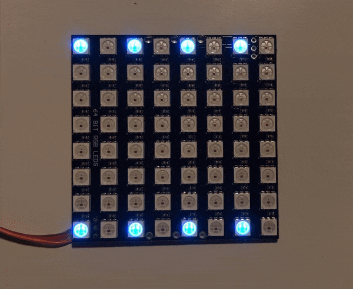

# This is a very WorkInProgress project.

# Smart LEDs matrix


A `DrawTarget` implementation to use (one, or more) smart LED matrixes as a graphics display driven by [embedded-graphics](https://docs.rs/embedded-graphics/latest/embedded_graphics/) `Drawable` objects.
The integrated driver is from [smart-leds](https://docs.rs/smart-leds/latest/smart_leds/) crate.

# Status
It works on some level. Rectangles are fine.

There are interesting issues though, with my setup (stm32f401 + 8x8 ws2812 matrix):
* circles are not exacly drawn always to the same position
* write operation usually gets back with an overrun error, while the display is still updated for ~every second time

# Plan
* Add more display types (like 2x2 or 1x4 grids of 8x8 matrixes), though user can add those anytime by implementing another `MatrixType`.

# Usage
You may start by creating creating a driver for your LED and controller. Some examples can be found [here](https://github.com/smart-leds-rs/smart-leds-samples).

Once you have it, you can plug it into the `DrawTarget` implemented by this crate.

Example:
```rust
use ws2812_spi as ws2812;

use smart_leds_matrix::*;

use embedded_graphics::{
    pixelcolor::*,
    prelude::*,
    primitives::{
        PrimitiveStyleBuilder, Rectangle,
    },
};

fn main() -> ! {
[...]
    let ws = ws2812::Ws2812::new(spi);
    let mut matrix = new_8x8(ws);
    matrix.set_brightness(15);
    matrix.clear(Rgb888::new(0, 0, 0));

    Rectangle::new(Point::new(1, 1), Size::new(6, 6))
    .into_styled(
        PrimitiveStyleBuilder::new()
        .fill_color(Rgb888::RED)
        .build(),
    ).draw(&mut matrix);    
    loop{}
}
```
